<!-- Terminal-window header (custom animated SVG, lives in /assets) -->
<p align="center">
  
</p>

---

### 🚀 About me

- 🎓 MSc Software Engineering & Data Science @ ESILV Paris
- 🔭 Repositioning from full-stack dev → Data Science / ML Engineering
- 🎯 Actively looking for a **6-month internship** in Data Science / ML
- 🧠 Recent work: Credit Risk Modeling (Scikit-learn, FastAPI, MLflow, Docker)
- 🌱 Currently exploring: MLOps, NLP, and secure software development
- 📫 Reach me: udhayakumar2352001@gmail.com | [LinkedIn](https://www.linkedin.com/in/udhayakumar-velou-758723172)

---

### 🛠️ Tech Stack

<p align="center">
  
</p>

---

### 📊 GitHub Stats

<p align="center">
  
  
</p>

<p align="center">
  
</p>

---

### 🏆 Trophies

<p align="center">
  
</p>

---

### 📈 Activity Graph

<p align="center">
  
</p>

---

### 💬 Random Dev Quote

<p align="center">
  
</p>

---

### 🎧 Now Playing on Spotify

> Live "currently playing" widget — needs a one-time ~10 min setup (deploying a small free service). Shows an animated bar with whatever track you're playing right now, falls back to your last played track otherwise.

<p align="center">
  
</p>

**Setup steps:**
1. Go to [Spotify Developer Dashboard](https://developer.spotify.com/dashboard) → create an app → note the **Client ID** and **Client Secret**. Set the redirect URI to `https://developer.spotify.com/callback`.
2. Visit this URL (replace `YOUR_CLIENT_ID`), log in, and copy the `code` param from the redirected URL:
   `https://accounts.spotify.com/authorize?client_id=YOUR_CLIENT_ID&response_type=code&redirect_uri=https://developer.spotify.com/callback&scope=user-read-currently-playing,user-read-recently-played`
3. Exchange that `code` for a **refresh token** (there's a step-by-step guide in the [novatorem/spotify-github-profile README](https://github.com/novatorem/spotify-github-profile)).
4. Fork [novatorem/spotify-github-profile](https://github.com/novatorem/spotify-github-profile), deploy it to [Vercel](https://vercel.com) (free), and add `SPOTIFY_CLIENT_ID`, `SPOTIFY_CLIENT_SECRET`, and `SPOTIFY_REFRESH_TOKEN` as environment variables in your Vercel project settings.
5. Once deployed, replace the image URL above with `https://YOUR-VERCEL-PROJECT.vercel.app/api/spotify`.

---

### 🎵 My Playlist

> A static, clickable card for a specific playlist — click the cover to open it in Spotify. (Note: this is different from "Now Playing" above — it doesn't update live, it's just a nice badge for a playlist you want to showcase.)

<p align="center">
  <a href="https://open.spotify.com/playlist/4RYa7DVhzcL1BXby733p6j">
    
  </a>
</p>

---

### 🐍 Contribution Snake

This one's genuinely fun: a snake "eats" your green contribution squares and moves automatically every day via GitHub Actions.

1. Create `.github/workflows/snake.yml` in this repo with the workflow below.
2. It generates an SVG and commits it to an `output` branch automatically.
3. Embed it here once generated (placeholder below).

```yaml
name: generate animation
on:
  schedule:
    - cron: "0 0 * * *"
  workflow_dispatch:
  push:
    branches:
      - main

jobs:
  generate:
    permissions:
      contents: write
    runs-on: ubuntu-latest
    steps:
      - uses: Platane/snk/svg-only@v3
        with:
          github_user_name: ${{ github.repository_owner }}
          outputs: |
            dist/github-contribution-grid-snake.svg
            dist/github-contribution-grid-snake-dark.svg?palette=github-dark
      - uses: crazy-max/ghaction-github-pages@v4
        with:
          target_branch: output
          build_dir: dist
        env:
          GITHUB_TOKEN: ${{ secrets.GITHUB_TOKEN }}
```

Then embed it here:

```markdown
<picture>
  <source media="(prefers-color-scheme: dark)" srcset="https://raw.githubusercontent.com/Udhayakumar-Velou/Udhayakumar-Velou/output/github-contribution-grid-snake-dark.svg" />
  
</picture>
```

---

<p align="center">
  
</p>
